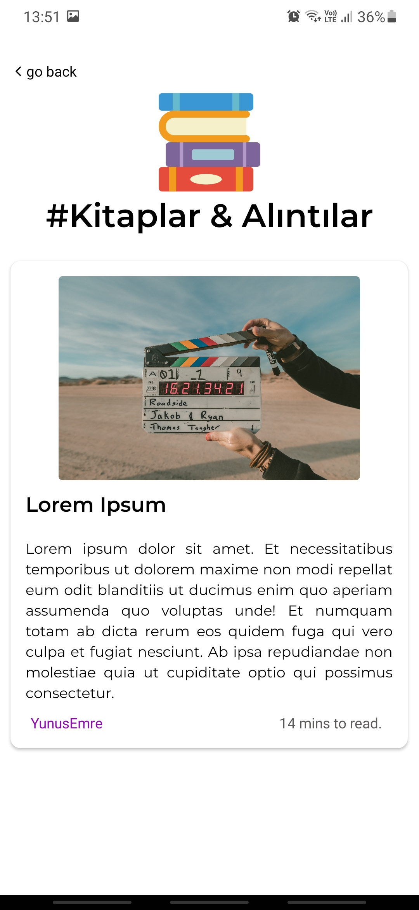
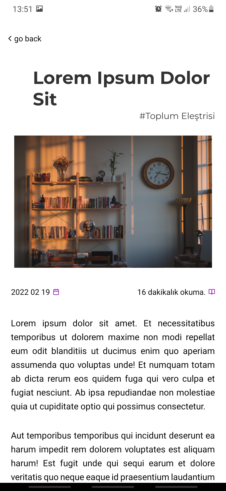

# React Native Blog App

## Backend
App uses [pencere blog](https://pencereblog.pythonanywhere.com/) website as backend.  
You can reach backend codes from [django-blog](https://github.com/YunusEmreUyar/Django-Blog) repository.

All blog features not implemented and this project is not completed yet but you can interact blog posts via commenting.

## Implemented Libraries
react-navigation 
expo 
expo-app-loading 
react-native-skeleton-content 
react-native-storage 
react-native-vector-icons 
react-native-async-storage 

## Installation and Usage: 

`git clone https://github.com/YunusEmreUyar/blogMobile.git` 
`cd blogMobile` 
`npm install` 
`expo start` 

## Some Pictures From The Project

